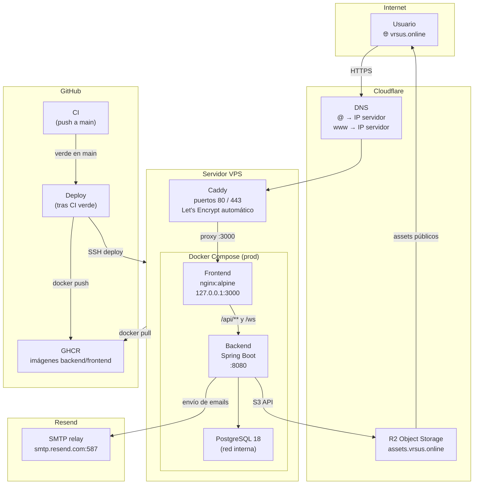
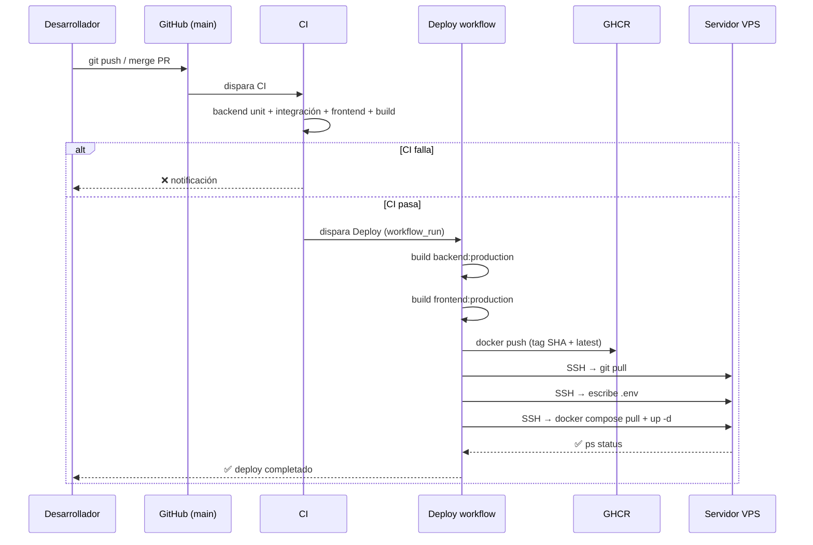

# Despliegue y entornos

## Producción

| Dato | Valor |
|---|---|
| **URL pública** | [https://vrsus.online](https://vrsus.online) |
| **Registrador de dominio** | Namecheap |
| **DNS** | Cloudflare (nameservers delegados desde Namecheap) |
| **Servidor** | VPS Linux (usuario de sistema: `deploy`) |
| **SSL/TLS** | Caddy — certificados Let's Encrypt automáticos |
| **Imágenes Docker** | GitHub Container Registry (GHCR) |
| **CI/CD** | GitHub Actions |
| **Email transaccional** | Resend (SMTP) |
| **Almacenamiento de ficheros** | Cloudflare R2 |

---

## Infraestructura — visión general



---

## Pipeline de CI/CD

El despliegue es **completamente automático**: cualquier push a `main` en el repositorio upstream desencadena la cadena completa. Los forks nunca disparan el deploy.



### Garantías del trigger

El job `build-and-push` solo se ejecuta si se cumplen las tres condiciones simultáneamente:

```yaml
conclusion == 'success'      # el CI pasó todos los tests
event == 'push'              # fue un push directo, no una PR de un fork
head_branch == 'main'        # el push fue a main, no a otra rama
```

### Archivos del workflow

| Archivo | Propósito |
|---|---|
| `.github/workflows/ci.yml` | Tests unitarios e integración en cada PR y push a main |
| `.github/workflows/deploy.yml` | Build de imágenes, push a GHCR y deploy SSH |

---

## Entornos disponibles

| Entorno | Composición Docker | Objetivo |
|---|---|---|
| **Desarrollo** | `docker-compose.yml` + `docker-compose.dev.yml` | Hot reload, pgAdmin, debug remoto, MailHog, seed de datos |
| **Test CI** | `docker-compose.test.yml` | Tests de integración aislados con BD efímera |
| **Producción** | `docker-compose.yml` + `docker-compose.prod.yml` | Imágenes optimizadas, sin herramientas de dev |

---

## Servicios en producción

| Servicio | Imagen | Puerto interno | Acceso exterior |
|---|---|---|---|
| **Frontend** | `ghcr.io/.../frontend:SHA` | `127.0.0.1:3000` | vrsus.online (vía Caddy) |
| **Backend** | `ghcr.io/.../backend:SHA` | `0.0.0.0:8080` | vrsus.online/api/ · /ws |
| **PostgreSQL** | `postgres:18-alpine` | red interna | no expuesto |
| **Scraper** | build local | — | bajo demanda (`restart: no`) |

El frontend solo escucha en `127.0.0.1:3000` — no es accesible directamente desde internet. Todo el tráfico público entra por Caddy.

---

## SSL y reverse proxy — Caddy

Caddy corre en el host (fuera de Docker) y gestiona los certificados Let's Encrypt de forma automática.

**Ubicación del Caddyfile:** `/etc/caddy/Caddyfile`

```caddy
vrsus.online, www.vrsus.online {
    reverse_proxy localhost:3000
}
```

Caddy renueva los certificados automáticamente antes de que expiren. No hay ninguna acción manual requerida.

```bash
# Ver estado
systemctl status caddy

# Recargar configuración sin cortar tráfico
systemctl reload caddy

# Ver logs
journalctl -u caddy -f
```

El nginx interno del contenedor frontend hace a su vez de proxy hacia el backend para `/api/` y `/ws`:

```nginx
location /api/ {
    proxy_pass http://backend:8080/;
}

location /ws {
    proxy_pass http://backend:8080/ws;
    proxy_http_version 1.1;
    proxy_set_header Upgrade $http_upgrade;
    proxy_set_header Connection "Upgrade";
}
```

---

## DNS — Cloudflare

El dominio está registrado en **Namecheap** con los nameservers delegados a **Cloudflare**, que es quien gestiona todos los registros DNS.

| Tipo | Nombre | Destino |
|---|---|---|
| `A` | `@` (vrsus.online) | IP del servidor VPS |
| `A` | `www` | IP del servidor VPS |
| `CNAME` | `assets` | bucket R2 (gestionado por Cloudflare) |
| `TXT` | `resend._domainkey` | clave DKIM de Resend |
| `TXT` | `@` | registro SPF de Resend |
| `MX` | `send` | servidor de feedback SES de Resend |

---

## Almacenamiento de ficheros — Cloudflare R2

Los avatares e imágenes subidas por usuarios se almacenan en **Cloudflare R2** (compatible con S3 API). El subdominio `assets.vrsus.online` sirve los ficheros públicamente.

El backend se conecta usando las variables de entorno `R2_ENDPOINT`, `R2_ACCESS_KEY_ID` y `R2_SECRET_ACCESS_KEY`. Ver la sección de variables de entorno más abajo.

---

## Email transaccional — Resend

Los correos (verificación de cuenta, reset de contraseña) se envían a través de **Resend** usando SMTP estándar. El dominio `vrsus.online` está verificado en Resend con registros DKIM y SPF en Cloudflare DNS.

| Parámetro | Valor |
|---|---|
| SMTP host | `smtp.resend.com` |
| Puerto | `587` (STARTTLS) |
| Usuario | `resend` (literal) |
| Contraseña | API key de Resend |
| Remitente | `noreply@vrsus.online` |

---

## Variables de entorno

Copia `.env.example` a `.env` para desarrollo local. En producción las gestiona el workflow de GitHub Actions — no hay `.env` manual en el servidor.

### Base de datos

| Variable | Descripción | Dev por defecto |
|---|---|---|
| `POSTGRES_DB` | Nombre de la BD | `appdb` |
| `POSTGRES_USER` | Usuario PostgreSQL | `appuser` |
| `POSTGRES_PASSWORD` | Contraseña PostgreSQL | `changeme` |

### JWT

| Variable | Descripción | Dev por defecto |
|---|---|---|
| `JWT_SECRET` | Clave de firma (≥ 64 chars) | valor de ejemplo inseguro |
| `JWT_EXPIRY` | Vida del access token (segundos) | `900` (15 min) |
| `JWT_REFRESH_EXPIRY` | Vida del refresh token (segundos) | `604800` (7 días) |

### Email / SMTP

| Variable | Descripción | Dev por defecto |
|---|---|---|
| `SMTP_HOST` | Servidor SMTP | `mailhog` (dev) |
| `SMTP_PORT` | Puerto SMTP | `1025` (dev) · `587` (prod) |
| `SMTP_USER` | Usuario SMTP | vacío |
| `SMTP_PASS` | Contraseña SMTP | vacío |
| `SMTP_AUTH` | Activar autenticación | `false` (dev) · `true` (prod) |
| `SMTP_STARTTLS` | Activar STARTTLS | `false` (dev) · `true` (prod) |
| `MAIL_FROM` | Dirección remitente | `noreply@versus-dev.local` |
| `MAIL_FROM_NAME` | Nombre remitente | `Versus Dev` |
| `VERSUS_EMAIL_ENABLED` | Activar envío real de emails | `false` (dev) · `true` (prod) |
| `FRONTEND_BASE_URL` | URL base para enlaces en emails | `http://localhost:4200` (dev) |

### Almacenamiento

| Variable | Descripción | Dev por defecto |
|---|---|---|
| `STORAGE_PROVIDER` | `local` o `r2` | `local` |
| `STORAGE_LOCAL_ROOT` | Ruta local (solo dev) | `target/local-storage` |
| `R2_ENDPOINT` | URL S3 del bucket R2 | — |
| `R2_ACCESS_KEY_ID` | Access key R2 | — |
| `R2_SECRET_ACCESS_KEY` | Secret key R2 | — |
| `R2_BUCKET` | Nombre del bucket | `versus-media` |
| `R2_PUBLIC_BASE_URL` | URL pública de assets | — |
| `MEDIA_PUBLIC_BASE_URL` | Igual que `R2_PUBLIC_BASE_URL` | — |

---

## Secrets de GitHub Actions

Los secrets se configuran en **Settings → Secrets and variables → Actions → Environment: `production`** del repositorio.

!!! warning "Nunca en el código"
    Ninguno de estos valores debe aparecer en ficheros del repositorio. El `.env` real está en `.gitignore`.

| Secret | Para qué sirve |
|---|---|
| `SSH_HOST` | IP o hostname del servidor VPS |
| `SSH_USER` | Usuario SSH (`deploy`) |
| `SSH_PRIVATE_KEY` | Clave privada SSH del par dedicado a CI |
| `SSH_PORT` | Puerto SSH (normalmente `22`) |
| `POSTGRES_DB` | Nombre de la BD en producción |
| `POSTGRES_USER` | Usuario PostgreSQL en producción |
| `POSTGRES_PASSWORD` | Contraseña PostgreSQL en producción |
| `JWT_SECRET` | Clave JWT — generar con `openssl rand -base64 64` |
| `JWT_EXPIRY` | Duración access token en segundos |
| `JWT_REFRESH_EXPIRY` | Duración refresh token en segundos |
| `SMTP_HOST` | `smtp.resend.com` |
| `SMTP_PORT` | `587` |
| `SMTP_USER` | `resend` |
| `SMTP_PASS` | API key de Resend |
| `SMTP_AUTH` | `true` |
| `SMTP_STARTTLS` | `true` |
| `MAIL_FROM` | `noreply@vrsus.online` |
| `MAIL_FROM_NAME` | `Versus` |
| `VERSUS_EMAIL_ENABLED` | `true` |
| `FRONTEND_BASE_URL` | `https://vrsus.online` |
| `STORAGE_PROVIDER` | `r2` |
| `R2_ENDPOINT` | URL S3 del bucket R2 |
| `R2_ACCESS_KEY_ID` | Access key R2 |
| `R2_SECRET_ACCESS_KEY` | Secret key R2 |
| `R2_BUCKET` | Nombre del bucket |
| `R2_PUBLIC_BASE_URL` | `https://assets.vrsus.online` |
| `MEDIA_PUBLIC_BASE_URL` | `https://assets.vrsus.online` |

---

## Arranque en desarrollo

```bash
# 1. Configurar entorno
cp .env.example .env

# 2. Levantar el stack completo (hot reload, pgAdmin, MailHog)
docker compose -f docker-compose.yml -f docker-compose.dev.yml up

# 3. (Opcional) Solo documentación MkDocs
docker compose -f docker-compose.yml -f docker-compose.dev.yml --profile docs up docs
```

El perfil `dev` activa `DDL_AUTO=create-drop` y `DevSeedConfig`, que inserta:

- 3 usuarios de prueba (roles: `PLAYER`, `MODERATOR`, `ADMIN`)
- 15 preguntas `BINARY` y 10 `NUMERIC` en estado `ACTIVE`

Credenciales de prueba:

| Email | Contraseña | Rol |
|---|---|---|
| `player@versus.com` | `player123` | PLAYER |
| `mod@versus.com` | `mod123` | MODERATOR |
| `admin@versus.com` | `admin123` | ADMIN |

Los emails en dev los intercepta **MailHog** — ábrelos en [http://localhost:8025](http://localhost:8025).

---

## Puertos expuestos

| Puerto | Servicio | Solo dev |
|---|---|---|
| `4200` | Angular frontend | ✅ |
| `8080` | Spring Boot API | — (prod también) |
| `5432` | PostgreSQL | ✅ |
| `5050` | pgAdmin | ✅ |
| `5005` | Java remote debug | ✅ |
| `8025` | MailHog web UI | ✅ |
| `1025` | MailHog SMTP | ✅ |

En producción solo el puerto `8080` del backend es accesible desde fuera de la red Docker. El frontend (`3000`) solo escucha en `127.0.0.1` y Caddy es el único punto de entrada público.

---

## Setup inicial del servidor

Estos pasos se hacen **una sola vez** al aprovisionar el servidor.

```bash
# Como root — crear usuario dedicado para el deploy
useradd -m -s /bin/bash deploy
usermod -aG docker deploy

# Añadir clave pública SSH de CI al usuario deploy
mkdir -p /home/deploy/.ssh && chmod 700 /home/deploy/.ssh
echo "ssh-ed25519 AAAA... clave_publica_ci" >> /home/deploy/.ssh/authorized_keys
chmod 600 /home/deploy/.ssh/authorized_keys
chown -R deploy:deploy /home/deploy/.ssh

# Instalar Docker
curl -fsSL https://get.docker.com | sh

# Instalar Caddy
apt install -y debian-keyring debian-archive-keyring apt-transport-https curl
curl -1sLf 'https://dl.cloudsmith.io/public/caddy/stable/gpg.key' \
    | gpg --dearmor -o /usr/share/keyrings/caddy-stable-archive-keyring.gpg
curl -1sLf 'https://dl.cloudsmith.io/public/caddy/stable/debian.deb.txt' \
    | tee /etc/apt/sources.list.d/caddy-stable.list
apt update && apt install caddy

# Clonar el repositorio
mkdir -p /opt/versus
chown deploy:deploy /opt/versus
su - deploy -c "git clone https://github.com/ualdra/versus2026.git /opt/versus"

# Configurar Caddy
cat > /etc/caddy/Caddyfile << 'EOF'
vrsus.online, www.vrsus.online {
    reverse_proxy localhost:3000
}
EOF
systemctl enable --now caddy
```

Después de este setup, cada push a `main` despliega automáticamente sin intervención manual.

---

## Healthchecks y observabilidad

| Endpoint | Descripción |
|---|---|
| `GET /actuator/health` | Estado del backend (Spring Actuator) |
| `GET /` | Angular devuelve 200 si el build está servido |

```bash
# Ver estado de todos los contenedores en producción
docker compose -f docker-compose.yml -f docker-compose.prod.yml ps

# Logs del backend
docker compose -f docker-compose.yml -f docker-compose.prod.yml logs -f backend

# Logs de Caddy
journalctl -u caddy -f
```

---

## Notas de escalado

- El backend es **stateless** en cuanto a sesiones HTTP (JWT). Se puede escalar horizontalmente sin sesiones pegajosas.
- Las sesiones de juego singleplayer (`sessionId`) viven en memoria del proceso — si hay más de una instancia de backend, el `sessionId` debe apuntar a la misma instancia (sticky sessions) o migrar a Redis.
- Los canales WebSocket STOMP usan el broker en memoria de Spring. Para múltiples instancias de backend se necesita un broker externo (RabbitMQ, Redis Pub/Sub).
