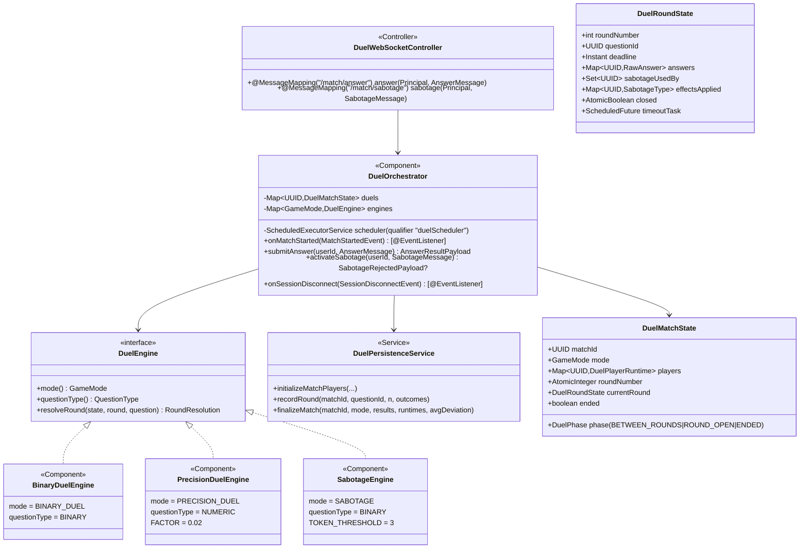
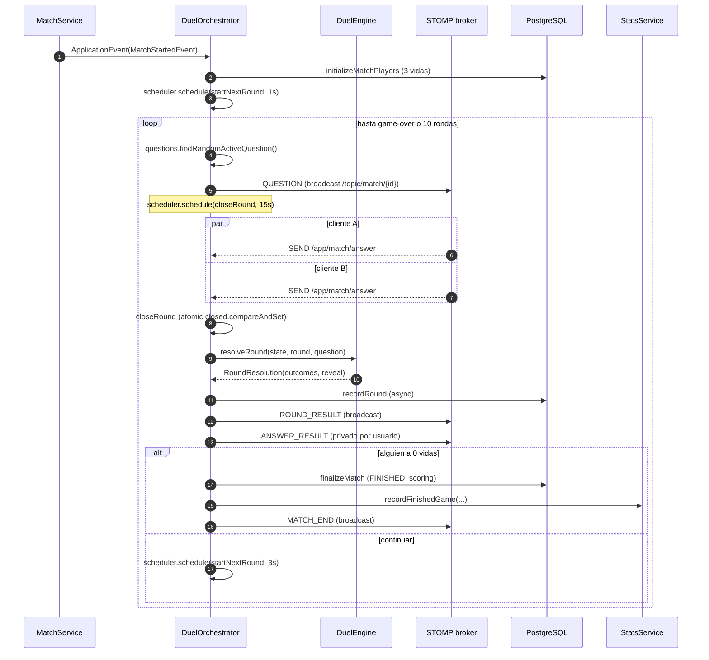

# Módulo: Duel (modos multijugador en vivo)

Paquete raíz: `com.versus.api.duel`
Depende de: `match` (estado de lobby), `questions` (catálogo), `websocket` (transport STOMP), `stats`, `achievements`
Estado:
- ✅ Esqueleto y wiring (PRs #91 #92 #93, Sprint 4).
- ✅ `BinaryDuelEngine` (#91), `PrecisionDuelEngine` (#92), `SabotageEngine` (#93).

---

## Responsabilidad

Orquesta el **ciclo de vida en vivo** de las partidas multijugador (`BINARY_DUEL`, `PRECISION_DUEL`, `SABOTAGE`) una vez `MatchService` emite `MATCH_START`. No gestiona lobby ni matchmaking — esa responsabilidad sigue en [`match`](match.md).

Tres responsabilidades:

1. **Programar rounds** con timer del servidor (15s default, 10s con `TIME_BOMB`) y cerrarlos cuando ambos jugadores responden o vence el deadline.
2. **Resolver cada round** delegando en el `DuelEngine` registrado por modo (strategy pattern).
3. **Persistir** rondas, respuestas y resultados al finalizar, integrando con `StatsService` y `AchievementService` igual que el modo single-player.

---

## Diagrama de clases

---

## Ciclo de vida del duelo

---

## Eventos WebSocket

### Cliente → servidor

| Destination | Payload | Acción |
|---|---|---|
| `/app/match/answer` | `AnswerMessage { matchId, questionId, optionId?, value? }` | Acumular respuesta. Cancelar timeout si ambos respondieron. |
| `/app/match/sabotage` | `SabotageMessage { matchId, type, targetUserId }` | Sólo modo SABOTAGE. Validar tokens, fase, target. |

### Servidor → cliente

Envueltos en `MatchEventEnvelope { type, matchId, payload }`.

| Tipo | Canal | Payload |
|---|---|---|
| `QUESTION` | `/topic/match/{id}` | `{ roundNumber, question, serverNow, deadline, timerSeconds, effectsApplied }` |
| `ANSWER_RESULT` | `/user/queue/match` | `{ accepted, rejectionReason?, isCorrect?, deviation? }` (solo confirmación) |
| `ROUND_RESULT` | `/topic/match/{id}` | `{ roundNumber, questionId, reveal, outcomes, runtime }` |
| `MATCH_END` | `/topic/match/{id}` | `{ winnerUserId?, reason, stats[] }` con `reason: NORMAL\|DISCONNECT\|MAX_ROUNDS_TIE` |
| `SABOTAGE_ACTIVATED` | `/topic/match/{id}` | `{ type, by, target, appliesOnRound }` |
| `SABOTAGE_REJECTED` | `/user/queue/match` | `{ reason: NO_TOKENS\|ALREADY_USED\|INVALID_TARGET\|WRONG_PHASE\|UNSUPPORTED_MODE }` |
| `EFFECT_APPLIED` | `/topic/match/{id}` | `{ type, target, roundNumber }` (junto al `QUESTION` siguiente) |

---

## Reglas por modo

### Binary Duel (#91)

- Pregunta BINARY compartida; respuesta incorrecta = **−1 vida**.
- Score = `streak × 50` al acertar.
- **Bonus de racha:** si A acierta con streak previo ≥ 1 y B falla, B pierde **−1 vida adicional** (calculado contra el snapshot pre-round).
- Sin respuesta antes del deadline = −1 vida y `answered=false`.

### Precision Duel (#92)

- Pregunta NUMERIC. `deviation% = |value − correctValue| / correctValue × 100`.
- Quien tenga **menor desviación** no pierde vida y suma +100 score.
- El perdedor recibe `lifeDelta = −max(1, ceil(|devLoser − devWinner| × 0.02))`.
- Empate de desviaciones → ambos +racha, 0 daño.
- Timeout → **−3 vidas** y deviation=100% para stats.
- Acumula `deviationSum`/`deviationCount` por jugador → `avgDeviation` final pasa a `StatsService.recordFinishedGame`.

### Sabotaje (#93)

Hereda la mecánica de Binary Duel + capa de efectos:

- **Token earning:** +1 `sabotageToken` cada 3 aciertos consecutivos (múltiplos de 3). Reset al fallar.
- **Catálogo (3 efectos):**
  - `TIME_BOMB` — próximo round del target tiene `deadline = now + 10s` (vs 15s default).
  - `OBFUSCATION` — el `QuestionPayload` enviado al target en binario omite una opción incorrecta; en numérico marca `noiseHint=10` en UI (server evalúa contra valor real).
  - `LIFE_STEAL` — si el target FALLA su próximo round, el atacante recupera +1 vida (cap a 3).
- **Validaciones server-side al activar:**
  - `NO_TOKENS` — `sabotageTokens == 0`.
  - `ALREADY_USED` — un sabotaje por jugador por round.
  - `WRONG_PHASE` — sólo en `ROUND_OPEN` y antes de responder.
  - `INVALID_TARGET` — no a sí mismo, target debe estar en la partida.
  - `UNSUPPORTED_MODE` — modo ≠ SABOTAGE.
- Efectos sólo se aplican al **siguiente** round y se consumen tras ese round.

---

## Configuración

Constantes hard-coded en `DuelOrchestrator` (sprint 4; configurables vía `application.yml` queda como issue de follow-up):

| Constante | Valor | Notas |
|---|---|---|
| `INITIAL_LIVES` | 3 | Igual que Survival |
| `DEFAULT_TIMER_SECONDS` | 15 | Por pregunta |
| `TIME_BOMB_TIMER_SECONDS` | 10 | Con sabotaje |
| `MAX_ROUNDS` | 10 | Anti-empate infinito |
| `FIRST_ROUND_DELAY_MS` | 1000 | Margen tras MATCH_START para que los clientes se suscriban |
| `BETWEEN_ROUNDS_DELAY_MS` | 3000 | Para mostrar reveal |
| `DISCONNECT_GRACE_MS` | 10000 | Antes de declarar pérdida por desconexión |

El `ScheduledExecutorService` se inyecta vía `@Bean duelScheduler` (`config/SchedulerConfig`, thread pool 4 daemon).

---

## Decisiones de diseño

1. **Strategy + Spring DI**: cada modo es un `DuelEngine` registrado como `@Component`. El orchestrator construye `Map<GameMode, DuelEngine>` desde la lista inyectada. Añadir un nuevo modo = nueva clase con `mode()` distinto. No tocar nada más.
2. **Composición, no herencia, con `LiveMatchState`**: `DuelMatchState` referencia el `matchId` y los `username` del estado de lobby pero gestiona su propio runtime. `LiveMatchState` se queda en `match` como SRP del lobby.
3. **Estado en memoria volátil**: igual que el lobby. Reinicio del backend = partidas perdidas. Documentado como limitación; futuro upgrade a Redis fuera de scope.
4. **Idempotencia de `closeRound`**: race condition timer vs. último jugador respondiendo. Resuelto con `AtomicBoolean closed.compareAndSet(false, true)` en `DuelRoundState`. Primer caller que entra cierra; el otro es no-op.
5. **Autoridad temporal en el servidor**: el `QuestionPayload` lleva `serverNow` + `deadline` (Instant). El cliente calcula `offset = serverNow − Date.now()` para mostrar countdown alineado, pero el servidor es quien decide cuándo cerrar el round.
6. **Persistencia async**: `recordRound` se ejecuta en el scheduler tras programar el siguiente round, no antes. La cadena `respuesta → próximo round` no espera a que se hayan flusheado los INSERTs.
7. **Acoplamiento mínimo con `MatchService`**: `DuelOrchestrator` escucha `MatchStartedEvent` vía `ApplicationEventPublisher`. `MatchService` ni siquiera importa la clase; sólo publica el evento si hay un publisher disponible (`@Autowired(required = false)`), por lo que tests existentes no rompen.

---

## Tests

| Fichero | Cobertura |
|---|---|
| `BinaryDuelEngineTest` | 9 tests: ambos aciertan/fallan, bonus de racha (con/sin streak previo), timeout, scoring por racha, reveal, pregunta sin opción correcta. |
| `PrecisionDuelEngineTest` | 8 tests: camino feliz, daño proporcional grande, empate, timeout (penalización), acumulador de deviation entre rounds, `correctValue=0` rechazado, reveal numérico, metadata. |
| `SabotageEngineTest` | 9 tests: token earning a 3 y 6 aciertos, reset al fallar, LIFE_STEAL aplica/no aplica, cap de vidas, bonus de racha intacto, `tokenThreshold()` accesor. |

Tests de orquestación end-to-end y manejo de desconexión (integration tests con `WebSocketStompClient` y 2 conexiones) quedan como follow-up; las reglas de race condition (`closeRound` idempotente) están cubiertas por la garantía del `AtomicBoolean` y validadas en revisión manual.

---

## Trabajo de follow-up (fuera del Sprint 4)

- Tests de integración WS con dos clientes STOMP simulados.
- Constantes (timer, vidas, rounds máx) configurables vía `application.yml`.
- Reconexión transparente: enviar `STATE_SNAPSHOT` al cliente que vuelve antes del grace period.
- Persistencia del runtime para sobrevivir reinicios (Redis o JPA-backed state).
- Modos 2v2 y torneos: estructura preparada para nuevos engines con `requiredPlayers > 2`.
