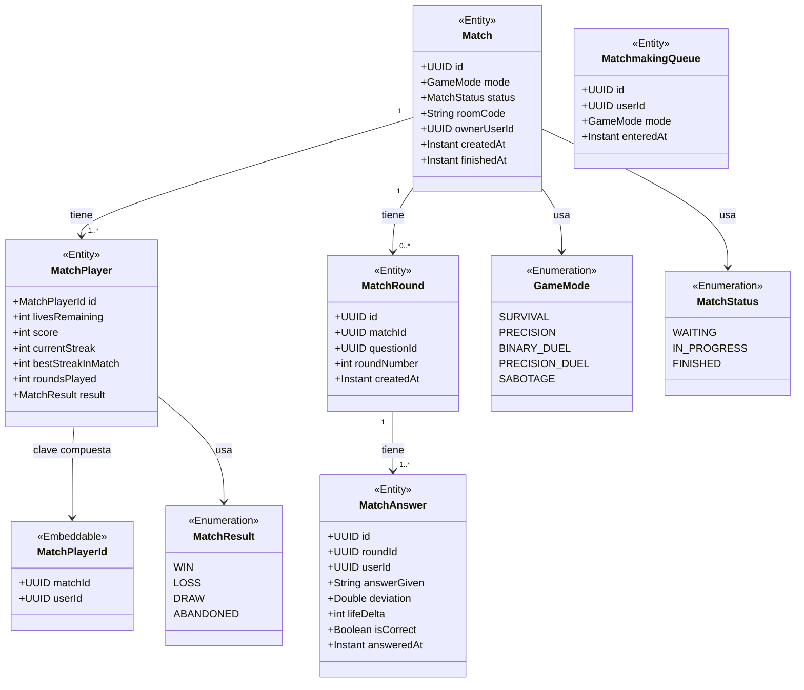
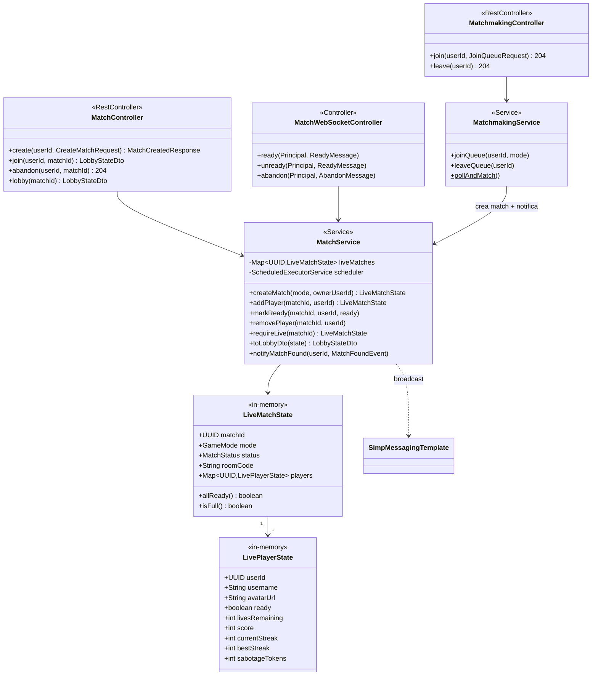
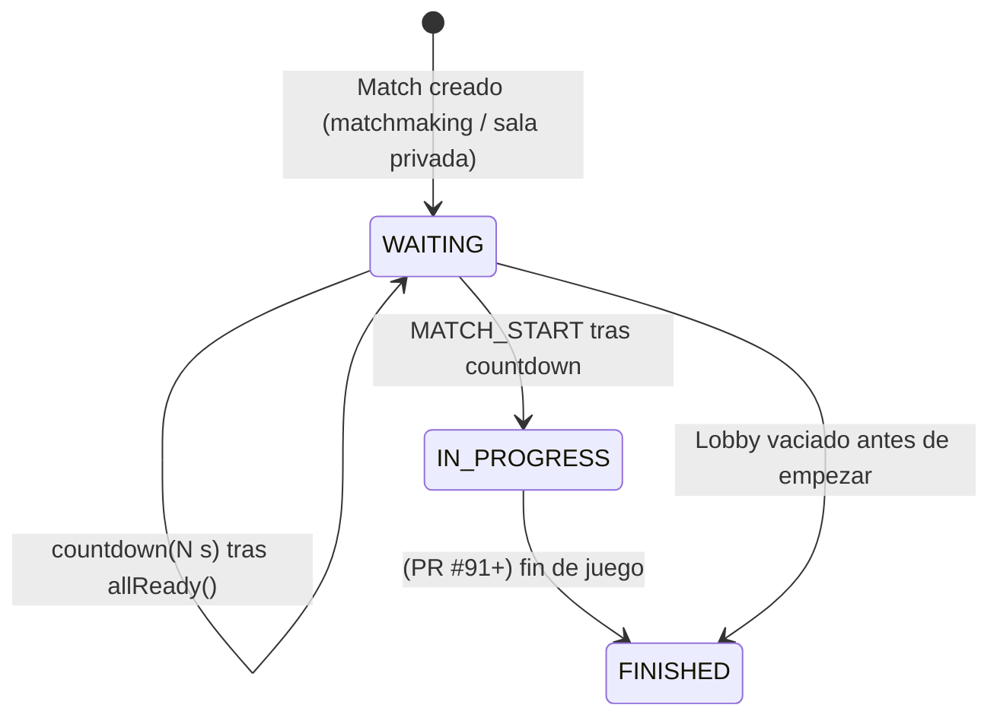
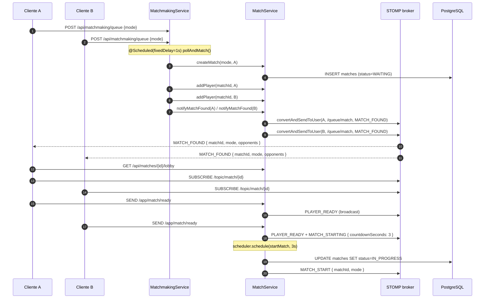

# Módulo: Partidas & Matchmaking

Paquete raíz: `com.versus.api.match`
Depende de: `users`, `questions`, `websocket`
Estado:
- ✅ **Lobby + matchmaking** (PR #90, Sprint 3) — REST de salas, scheduler de emparejamiento, lobby en tiempo real con countdown.
- ✅ **Modos multijugador**: la lógica de partida (`BINARY_DUEL` #91, `PRECISION_DUEL` #92, `SABOTAGE` #93) vive ahora en el módulo [`duel`](duel.md) (Sprint 4). `MatchService` publica `MatchStartedEvent` y el `DuelOrchestrator` arranca el ciclo de rondas.

---

## Responsabilidad

Define el ciclo de vida completo de una partida multijugador: creación de la sala, emparejamiento por modo, lobby con jugadores marcando "listo", countdown sincronizado, transición a `IN_PROGRESS`. La lógica concreta de cada modo (preguntas, daño, sabotaje) la añaden los PRs siguientes encima de esta base.

Ámbito explícitamente fuera (queda para PRs siguientes):

- Emisión de preguntas y evaluación de respuestas (PR #91 en adelante).
- Persistencia de `match_rounds` / `match_answers` (sucede en `endMatch`, lógica futura).
- Salas privadas con `roomCode` para invitar amigos (issue #105).

---

## Diagrama de clases



---

## Capa de servicio (PR #90)



---

## Ciclo de vida de una partida



---

## Flujo end-to-end (matchmaking → lobby → start)



---

## Endpoints REST

`MatchController` (`/api/matches`):

| Método | Ruta | Body | Respuesta | Notas |
|---|---|---|---|---|
| `POST` | `/api/matches` | `{ mode: GameMode }` | `201 { matchId, mode, roomCode }` | Crea sala y añade al creador como primer player. Rechaza modos solo. |
| `POST` | `/api/matches/{id}/join` | — | `200 LobbyStateDto` | Falla con `409` si llena o `status≠WAITING`. |
| `DELETE` | `/api/matches/{id}/abandon` | — | `204` | Si la sala queda vacía y aún en `WAITING`, se cierra. |
| `GET` | `/api/matches/{id}/lobby` | — | `200 LobbyStateDto` | Snapshot inicial usado tras un refresh de la pestaña. |

`MatchmakingController` (`/api/matchmaking/queue`):

| Método | Ruta | Body | Respuesta |
|---|---|---|---|
| `POST` | `/api/matchmaking/queue` | `{ mode: GameMode }` | `204` (entra en cola) |
| `DELETE` | `/api/matchmaking/queue` | — | `204` (sale de cola) |

Todos requieren `Authorization: Bearer <jwt>`. El `userId` se inyecta vía `@AuthenticationPrincipal` — nunca se confía en payloads que digan "soy el user X".

---

## Eventos WebSocket emitidos

Todos los eventos viajan envueltos en `MatchEventEnvelope` (ver módulo [websocket](websocket.md)):

```json
{ "type": "<tipo>", "matchId": "<uuid>", "payload": { ... } }
```

| Tipo | Canal | Cuándo se emite | Payload |
|---|---|---|---|
| `MATCH_FOUND` | `/user/{userId}/queue/match` | El scheduler empareja a este jugador. | `{ matchId, mode, opponents: PlayerInLobbyDto[] }` |
| `PLAYER_JOINED` | `/topic/match/{matchId}` | Un nuevo jugador entra al lobby. | `{ player: PlayerInLobbyDto }` |
| `PLAYER_LEFT` | `/topic/match/{matchId}` | Un jugador abandona (REST o WS). | `{ userId }` |
| `PLAYER_READY` | `/topic/match/{matchId}` | Cualquier jugador alterna el flag ready. | `{ userId, ready }` |
| `MATCH_STARTING` | `/topic/match/{matchId}` | Todos están listos → arranca countdown. | `{ countdownSeconds: 3 }` |
| `MATCH_START` | `/topic/match/{matchId}` | Termina el countdown y `status` pasa a `IN_PROGRESS`. | `{ matchId, mode }` |

Mensajes que el cliente envía:

| Destination | Payload | Acción |
|---|---|---|
| `/app/match/ready` | `{ matchId }` | `MatchService.markReady(matchId, userId, true)`. |
| `/app/match/unready` | `{ matchId }` | `MatchService.markReady(matchId, userId, false)`. |
| `/app/match/abandon` | `{ matchId }` | `MatchService.removePlayer(matchId, userId)`. |

> El `userId` siempre se obtiene del `Principal` validado por `JwtChannelInterceptor`, nunca del payload.

---

## Modelo de estado en memoria

El estado en vivo de cada partida (qué jugadores hay, quién está listo, si el countdown está corriendo) vive en un `Map<UUID, LiveMatchState>` del singleton `MatchService` — **no en BD**. Esta es la decisión clave:

> **Persistencia mínima:** la fila de `matches` se inserta al crear la sala (status `WAITING`), se actualiza a `IN_PROGRESS` al arrancar y a `FINISHED` cuando se vacía o termina. Los detalles de jugadores listos/no listos no se persisten — son ruido para BD y se pierden si el server cae a media partida (asumido por simplicidad).

Razones:
- Latencia: cada cambio de ready dispara un broadcast en < 5 ms; no queremos round-trip a BD.
- Idempotencia: si el server cae con la sala en `WAITING`, las rondas no han empezado y no se pierde nada de juego real.
- `match_rounds` / `match_answers` se escribirán en bloque al final de la partida (PR #91 en adelante).

**Concurrencia:** todas las mutaciones sobre un `LiveMatchState` se hacen dentro de `synchronized(state)`. La granularidad es por partida — partidas distintas no se bloquean entre sí.

**Countdown:** programado con un `ScheduledExecutorService` propio del service (no `@Scheduled`), porque cada partida tiene su propio temporizador. Daemon threads — no impiden el shutdown de la JVM.

---

## Algoritmo de matchmaking

`MatchmakingService.pollAndMatch()` corre cada 1 s (`@Scheduled(fixedDelay = 1000)`):

1. Para cada `GameMode.isMultiplayer()`:
2. Lee la cola FIFO `findByModeOrderByEnteredAtAsc(mode)`.
3. Mientras haya ≥ `mode.requiredPlayers()` jugadores en cola:
   - Coge los N primeros.
   - Llama a `matchService.createMatch(mode, owner)` y `addPlayer(...)` por cada uno.
   - Borra esas entradas de `matchmaking_queue`.
   - Envía `MATCH_FOUND` a cada uno con la lista de oponentes (excluyendo al destinatario).

> **Por qué FIFO simple:** el MVP del Sprint 3 no necesita Elo, ranking de cola ni regiones. Si dos personas están en cola del mismo modo, las empareja. Cualquier afinamiento futuro se hace dentro de `pairUp()`.

---

## Cliente Angular (PR #90)

| Pieza | Fichero | Rol |
|---|---|---|
| `MatchService` (TS) | `frontend/src/app/core/services/match.service.ts` | REST + suscripción a `/topic/match/{id}` y `/user/queue/match`; helpers `sendReady`, `sendUnready`, `sendAbandon`. |
| Página `Queue` | `frontend/src/app/features/player/pages/queue/queue.ts` | Pulsa `joinQueue(mode)`, espera `MATCH_FOUND`, redirige a `/play/lobby/:matchId`. |
| Página `Lobby` | `frontend/src/app/features/player/pages/lobby/lobby.ts` | Carga estado vía `getLobby`, suscribe a `lobbyEvents$`, máquina de estados `loading → lobby → starting → started/left/error`, botón ready, countdown sincronizado. |
| `mode-select` | `frontend/src/app/features/player/pages/mode-select/mode-select.ts` | Cards multijugador rutean a `/play/queue/{key}` (`binary`, `pduel`, `sabotage`). |

Estado del componente `Lobby` (signals):

```ts
status: 'loading' | 'lobby' | 'starting' | 'started' | 'left' | 'error'
lobby: LobbyState | null
countdown: number | null
```

El lobby **no muta de forma optimista** al pulsar ready: espera al evento `PLAYER_READY` del server. Esto garantiza que ambos clientes ven el mismo estado en el mismo orden y simplifica la conciliación tras una reconexión.

> **Nota provisional (PR #90):** al recibir `MATCH_START`, el lobby sólo cambia el status a `started` y muestra un banner. La navegación real a `/play/binary-duel/:matchId`, `/play/precision-duel/:matchId` o `/play/sabotage/:matchId` se añade en los PRs #91/#92/#93 cuando esas páginas existan.

---

## Entidades JPA (sin cambios respecto al Sprint 1-2)

### `Match`

```
Tabla: matches
┌──────────────┬──────────────────────────────────────────────────────┐
│ Columna      │ Notas                                                │
├──────────────┼──────────────────────────────────────────────────────┤
│ id           │ UUID, PK                                             │
│ mode         │ ENUM(GameMode)                                       │
│ status       │ ENUM(WAITING, IN_PROGRESS, FINISHED)                │
│ room_code    │ VARCHAR(16), generado server-side al crear           │
│ owner_user_id│ UUID (quien creó la sala)                            │
│ created_at   │ TIMESTAMPTZ                                          │
│ finished_at  │ TIMESTAMPTZ, nullable                                │
└──────────────┴──────────────────────────────────────────────────────┘
```

### `MatchPlayer`

Clave compuesta `(match_id, user_id)` — un usuario sólo puede estar una vez por partida.

```
Tabla: match_players
┌──────────────────┬──────────────────────────────────────────────────┐
│ Columna          │ Notas                                            │
├──────────────────┼──────────────────────────────────────────────────┤
│ match_id         │ UUID, PK parte 1                                 │
│ user_id          │ UUID, PK parte 2                                 │
│ lives_remaining  │ INT, inicializado según modo                     │
│ score            │ INT, default 0                                   │
│ current_streak   │ INT, default 0                                   │
│ best_streak      │ INT, default 0                                   │
│ rounds_played    │ INT, default 0                                   │
│ result           │ ENUM(MatchResult), nullable hasta finalizar      │
└──────────────────┴──────────────────────────────────────────────────┘
```

> En PR #90 los `MatchPlayer` aún no se persisten en cada cambio de ready: viven como `LivePlayerState` en memoria. Se materializarán en la BD en `endMatch()` (PR #91+) en bloque junto con las rondas.

### `MatchRound` y `MatchAnswer`

Sin cambios — pendientes de poblar a partir de PR #91.

### `MatchmakingQueue`

```
Tabla: matchmaking_queue
┌──────────────┬──────────────────────────────────────────────────────┐
│ Columna      │ Notas                                                │
├──────────────┼──────────────────────────────────────────────────────┤
│ id           │ UUID, PK                                             │
│ user_id      │ UUID (unique — un user, una entrada como mucho)      │
│ mode         │ ENUM(GameMode)                                       │
│ entered_at   │ TIMESTAMPTZ (indexed con mode para FIFO por modo)   │
└──────────────┴──────────────────────────────────────────────────────┘
Índice: (mode, entered_at) — permite matchmaking FIFO por modo
```

`joinQueue` es idempotente sobre el mismo modo y reemplaza la entrada si el usuario cambia de modo sin salir antes.

---


## Pruebas

### Backend

| Fichero | Cobertura |
|---|---|
| `MatchServiceTest.java` | `createMatch`, `addPlayer` (idempotente / sala llena), `markReady`, broadcast de countdown cuando todos listos, `removePlayer` (limpieza al vaciar), `notifyMatchFound`. |
| `MatchmakingServiceTest.java` | `joinQueue` (idempotencia y cambio de modo), `leaveQueue`, `pollAndMatch` con 2 y 4 jugadores → 1 y 2 partidas creadas y colas vaciadas. |
| `JwtChannelInterceptorTest.java` | (en módulo websocket) auth STOMP. |

### Frontend

| Fichero | Cobertura |
|---|---|
| `lobby.spec.ts` | `ngOnInit` carga lobby + suscribe; `PLAYER_READY` muta el flag; `MATCH_STARTING` activa countdown; `MATCH_START` pasa a `started`; `toggleReady` envía `sendReady`/`sendUnready` según el estado actual; `cancel` llama a `abandonMatch` y navega; `PLAYER_LEFT` redirige a `/play/select` tras 2 s. |

### Smoke E2E manual (criterios de aceptación PR #90)

Dos navegadores logueados como `playerA` y `playerB`:

1. Ambos van a `/play/select` → click "DUELO BINARIO" → llegan a `/play/queue/binary` → en < 5 s redirigidos al mismo `/play/lobby/<uuid>`.
2. Cada uno ve al otro en el panel del rival con su username/avatar.
3. A pulsa LISTO → ambos ven la pill verde de A. B pulsa LISTO → countdown 3-2-1 sincronizado.
4. Tras el countdown ambos ven banner "¡PARTIDA INICIADA!" (la UI del modo es trabajo de PR #91).
5. Si A pulsa CANCELAR antes del countdown, B ve "El rival ha abandonado" y vuelve a `/play/select` tras 2 s.
6. Refrescar la pestaña de A en `/play/lobby/:id` reconstruye el estado vía `GET /api/matches/{id}/lobby` + reconexión WS, sin afectar a B.

## WebSocket

La capa de transport en tiempo real (endpoint `/ws`, autenticación JWT en `CONNECT`, convenciones de canales `/topic`, `/user/queue` y `/app`, envelope estándar `MatchEventEnvelope`) está documentada en su módulo propio:

→ **[Módulo: WebSocket multijugador](websocket.md)** (Sprint 3, PR #89)

Resumen para este módulo:
- Suscripción compartida de la partida: `/topic/match/{matchId}`
- Notificaciones privadas al jugador: `/user/queue/match`
- Envío de acciones del cliente: `/app/match/answer`, `/app/match/ready`, `/app/match/abandon`, `/app/match/sabotage`

Los handlers concretos (`MatchWebSocketController`) se añaden a este módulo en PR #90 y siguientes.


---

## Decisiones de diseño que conviene recordar

1. **Estado en memoria, persistencia mínima.** Sólo `matches` se toca durante el lobby (`WAITING`/`IN_PROGRESS`/`FINISHED`). `match_players` / `match_rounds` / `match_answers` se materializan en bloque al final de la partida (PR #91+). Si el server cae en lobby, esa partida se descarta.
2. **`@AuthenticationPrincipal UUID userId` en cada controller.** Convención del proyecto: el filtro JWT inyecta directamente el UUID, sin necesidad de parsear claims en el handler.
3. **El cliente nunca dicta su identidad.** `markReady` ignora cualquier `userId` que venga en el payload — usa `Principal.getName()`.
4. **Sincronización por partida, no global.** Cada `LiveMatchState` se accede bajo `synchronized(state)`. Nada de un lock compartido por todo el servicio.
5. **Broadcast siempre vía `MatchEventEnvelope`.** Cualquier handler nuevo en PRs siguientes debe seguir este formato — el frontend hace `switch(event.type)` sin más conocimiento.
6. **Countdown server-side, no cliente-side.** El cliente puede mostrar 3-2-1 visualmente pero la decisión real de cuándo llega `MATCH_START` la toma el server. Evita desincronización entre clientes.

---

## Trabajo pendiente (PRs siguientes)

- ✅ **PRs #91/#92/#93** (Sprint 4): la lógica de los 3 modos multijugador vive en el módulo [`duel`](duel.md). `MatchService.startMatch()` publica `MatchStartedEvent` y el `DuelOrchestrator` toma el relevo.
- **Salas privadas con `roomCode`:** issue #105, fuera del Sprint 4.
- **Persistencia del runtime para sobrevivir reinicios** (Redis): seguimiento futuro; ver [`duel.md`](duel.md#trabajo-de-follow-up-fuera-del-sprint-4).
