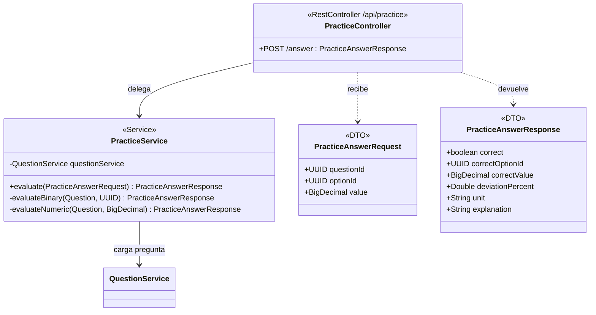

# Módulo: Práctica

Paquete raíz: `com.versus.api.practice`  
Depende de: `questions`  
Estado: ✅ implementado

---

## Responsabilidad

Modo de juego libre sin sesión de partida. El jugador elige una categoría y tipo de pregunta, contesta, y ve la respuesta correcta con explicación inmediatamente. **No se crea ningún registro** en `matches`, `match_players`, `match_rounds` ni `match_answers`, y no se actualizan `player_stats`.

El endpoint es **público** — no requiere JWT — para que sea accesible como modo demo.

---

## Diagrama de clases



---

## Endpoint

| Método | Ruta | Auth | Body | Respuesta |
|---|---|---|---|---|
| `POST` | `/api/practice/answer` | No (público) | `PracticeAnswerRequest` | `200 PracticeAnswerResponse` |

---

## Contratos

### Request

```json
POST /api/practice/answer

// BINARY — se envía optionId:
{
  "questionId": "uuid-pregunta",
  "optionId": "uuid-opcion-elegida"
}

// NUMERIC — se envía value:
{
  "questionId": "uuid-pregunta",
  "value": 650000000
}
```

> `optionId` y `value` son opcionales en el JSON, pero el servicio valida que el campo correcto esté presente según el tipo de pregunta. Si falta, devuelve `400 VALIDATION_ERROR`.

### Response

```json
// BINARY correcta:
{
  "correct": true,
  "correctOptionId": "uuid-opcion-correcta",
  "explanation": "Messi tiene más seguidores porque..."
}

// BINARY incorrecta:
{
  "correct": false,
  "correctOptionId": "uuid-opcion-correcta"
}

// NUMERIC dentro de tolerancia:
{
  "correct": true,
  "correctValue": 640000000,
  "deviationPercent": 1.56,
  "unit": "millones",
  "explanation": "En 2023 Cristiano tenía 640M de seguidores."
}

// NUMERIC fuera de tolerancia:
{
  "correct": false,
  "correctValue": 640000000,
  "deviationPercent": 20.31,
  "unit": "millones"
}
```

Los campos `null` se omiten en la respuesta JSON (`@JsonInclude(NON_NULL)`).

---

## Lógica de evaluación

### BINARY

1. Buscar la opción `optionId` en las opciones de la pregunta. Si no pertenece → `400`.
2. `correct = option.isCorrect`.
3. `correctOptionId` = la opción donde `isCorrect = true` (siempre presente).

### NUMERIC

La fórmula de desviación es la misma que en Modo Precisión (`GameService`):

```
deviationPercent = |value - correctValue| / |correctValue| * 100
correct          = deviationPercent ≤ tolerancePercent (default 5%)
```

> Si `correctValue` es null o 0 → `400 VALIDATION_ERROR` (evita división por cero).

### explanation

Si `question.explanation` no es null, se incluye en la respuesta. El campo es nullable en BD — los scrapers lo rellenarán gradualmente.

---

## Errores

| Situación | ErrorCode | HTTP |
|---|---|---|
| Pregunta no encontrada o inactiva | `NOT_FOUND` | 404 |
| `optionId` nulo en pregunta BINARY | `VALIDATION_ERROR` | 400 |
| `optionId` no pertenece a la pregunta | `VALIDATION_ERROR` | 400 |
| `value` nulo en pregunta NUMERIC | `VALIDATION_ERROR` | 400 |
| `correctValue` nulo o 0 en pregunta NUMERIC | `VALIDATION_ERROR` | 400 |

---

## Tests

`PracticeServiceTest` cubre los siguientes casos con Mockito:

| Caso | Verificación |
|---|---|
| BINARY correcta | `correct=true`, `correctOptionId` = la opción correcta |
| BINARY incorrecta | `correct=false`, `correctOptionId` apunta a la real |
| Explicación devuelta | `explanation` incluida si existe |
| `optionId` nulo | `VALIDATION_ERROR` |
| `optionId` ajena | `VALIDATION_ERROR` |
| Sin campos numéricos en BINARY | `correctValue` y `deviationPercent` nulos |
| NUMERIC dentro de tolerancia | `correct=true`, `correctValue` devuelto |
| NUMERIC fuera de tolerancia | `correct=false`, `deviationPercent` calculado |
| `tolerancePercent=null` | Usa el 5% por defecto |
| Unidad devuelta | `unit` presente en respuesta NUMERIC |
| `value` nulo | `VALIDATION_ERROR` |
| `correctValue` nulo / 0 | `VALIDATION_ERROR` |
| Sin campos binarios en NUMERIC | `correctOptionId` nulo |
