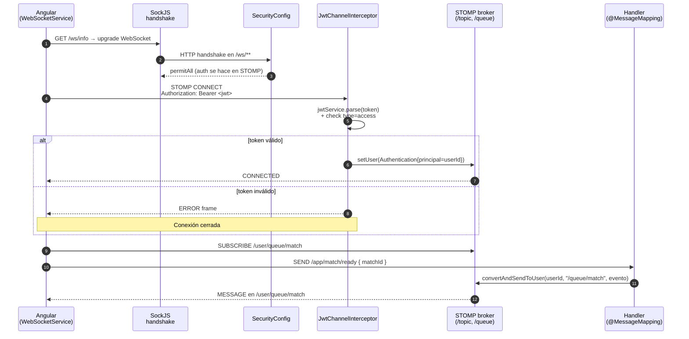
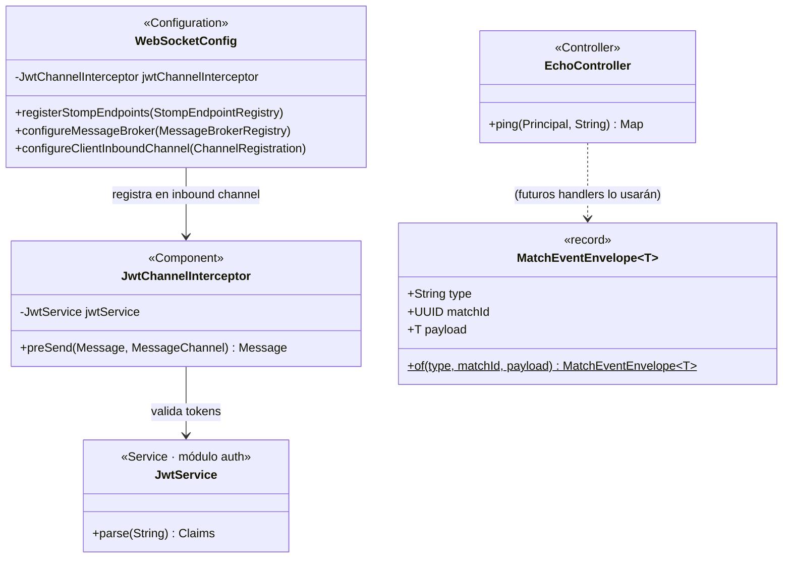

# Módulo: WebSocket multijugador

Paquete raíz: `com.versus.api.websocket`
Depende de: `auth` (para validar JWT)
Estado: ✅ infraestructura base (PR #89, Sprint 3) — handlers de partida pendientes (PR #90 en adelante)

---

## Responsabilidad

Provee el **canal en tiempo real** sobre el que se construyen el lobby, el matchmaking y los modos multijugador. La infra base hace tres cosas y nada más:

1. Expone un endpoint `/ws` con STOMP sobre WebSocket (con fallback SockJS).
2. Autentica cada conexión usando el mismo JWT que el resto del API.
3. Define la "envoltura" estándar de eventos (`MatchEventEnvelope`) que enviarán los handlers de los próximos PRs.

Lo que **no** hace este módulo: lógica de partida, matchmaking, persistencia. Eso vive en `match` y se construye encima de esta capa.

---

## Visión general del flujo



> **Por qué STOMP y no WebSocket "puro":** STOMP nos da pub/sub (`/topic/*`) y enrutado por usuario (`/user/queue/*`) gratis, lo que evita reescribir un protocolo de mensajería propio. Spring lo soporta de fábrica con `@EnableWebSocketMessageBroker`.

> **Por qué SockJS además de WS:** algunos proxies / antivirus corporativos bloquean WebSocket. SockJS hace fallback transparente a long-polling. El cliente Angular siempre va por SockJS; el server acepta ambos.

---

## Diagrama de clases



---

## Endpoint y transport

| Aspecto | Valor |
|---|---|
| URL del handshake | `ws://localhost:8080/ws` (dev) |
| Transport principal | WebSocket nativo |
| Transport fallback | SockJS (long-polling) |
| Origenes permitidos | `http://localhost:4200` (configurable) |
| Heartbeat in/out | 10 s / 10 s |

El endpoint se registra **dos veces** en `WebSocketConfig.registerStompEndpoints`: una versión "raw" para clientes que pueden hablar WebSocket directo y una con `.withSockJS()` para los que necesitan fallback. El cliente Angular usa siempre la variante SockJS.

`SecurityConfig` permite `/ws/**` sin filtro JWT HTTP — la seguridad real ocurre dentro del frame STOMP CONNECT, no en el handshake HTTP.

---

## Autenticación

`JwtChannelInterceptor` se ejecuta antes de cualquier `@MessageMapping`. Valida solo frames `CONNECT`:

1. Lee la cabecera nativa `Authorization` del frame STOMP.
2. Verifica que empiece con `Bearer `.
3. Llama a `JwtService.parse(token)` (la misma que usa `JwtAuthFilter` en HTTP).
4. Comprueba que el claim `type` sea `access` (rechaza refresh tokens).
5. Construye un `UsernamePasswordAuthenticationToken` con:
   - **principal** = `UUID` del usuario (extraído de `claims.getSubject()`).
   - **authority** = `ROLE_<role>` con el claim `role`.
6. Lo asocia al accessor con `accessor.setUser(auth)`.

A partir de ese momento:
- Cualquier `@MessageMapping` puede inyectar `Principal` y obtener el `userId` con `principal.getName()`.
- `convertAndSendToUser(userId, "/queue/...", payload)` enruta el mensaje al socket correcto.

Si el token falta, no es Bearer, está caducado, está firmado con otra clave o es un refresh token, el interceptor lanza `MessageDeliveryException` y la conexión se cierra con un frame `ERROR`.

> **Cómo lo manda el cliente:** el `WebSocketService` del frontend lee el JWT con `AuthService.getAccessToken()` y lo pone en `connectHeaders` del cliente STOMP — *no* va en la URL ni en cookies.

---

## Convención de canales

| Prefijo | Uso | Ejemplo |
|---|---|---|
| `/app/*` | Mensajes que el **cliente envía al servidor** (despacha a `@MessageMapping`). | `/app/match/answer`, `/app/match/ready` |
| `/topic/*` | Broadcast a todos los suscriptores. | `/topic/match/{matchId}` (estado compartido) |
| `/user/queue/*` | Mensaje **privado** dirigido a un usuario concreto. Spring resuelve `{userId}` desde el `Principal` autenticado. | `/user/queue/match` (notificaciones tipo "te tocó pareja") |

Reglas:
- **Nunca** envíes datos privados por `/topic/...` — todos los suscritos los reciben.
- Si el rival no debe ver el payload (caso típico: efecto de sabotaje aplicado solo a uno), usa `convertAndSendToUser` en vez de `convertAndSend`.

---

## Envelope estándar

Todos los eventos enviados por `/topic/match/{id}` usan `MatchEventEnvelope`:

```java
public record MatchEventEnvelope<T>(String type, UUID matchId, T payload) {}
```

Ejemplo de uso desde un handler:

```java
@Autowired SimpMessagingTemplate broker;

broker.convertAndSend(
    "/topic/match/" + matchId,
    MatchEventEnvelope.of("ROUND_RESULT", matchId, new RoundResultDto(...))
);
```

El cliente Angular recibe siempre la misma forma `{ type, matchId, payload }` y hace `switch (type)` para decidir qué hacer. Los tipos disponibles están enumerados en `frontend/src/app/core/models/ws.models.ts` (`WsEventType`).

---

## Cliente Angular — `WebSocketService`

Fichero: `frontend/src/app/core/services/websocket.service.ts`

```ts
@Injectable({ providedIn: 'root' })
export class WebSocketService {
  connect(): void                                   // idempotente; lee JWT del AuthService
  disconnect(): void
  subscribe<T>(destination: string): Observable<T>  // re-suscribe automáticamente al reconectar
  publish<T>(destination: string, body?: T): void   // descarta silencioso si no está conectado
  readonly connected$: Observable<boolean>
}
```

Características:

- Usa `@stomp/stompjs` 7.x + `sockjs-client`.
- Reconexión automática cada 5 s.
- `subscribe()` está hecho con `connected$.pipe(filter(c => c), switchMap(...))` — esto significa que **al reconectar, todas las suscripciones activas se restablecen sin código adicional** del componente.
- `publish()` no encola: si no estás conectado, el mensaje se descarta y se loguea un warning. Es responsabilidad del caller llamar `connect()` antes.

URL base configurable en `frontend/src/environments/environment.ts → wsUrl`.

---

## Cómo añadir un nuevo handler

```java
@Controller
@RequiredArgsConstructor
public class MiHandler {

    private final SimpMessagingTemplate broker;

    @MessageMapping("/match/answer")        // recibe SEND a /app/match/answer
    public void handleAnswer(@Payload AnswerMessage msg, Principal principal) {
        UUID userId = UUID.fromString(principal.getName());
        // ... lógica ...
        broker.convertAndSend(
            "/topic/match/" + msg.matchId(),
            MatchEventEnvelope.of("ANSWER_RESULT", msg.matchId(), result)
        );
    }
}
```

Pautas:

- **Nunca** uses `@SendTo`/`@SendToUser` directamente desde el handler si el evento no es la respuesta inmediata al SEND. Para mensajes asíncronos o broadcasts, inyecta `SimpMessagingTemplate` y llama a `convertAndSend(...)` / `convertAndSendToUser(...)`.
- Cualquier excepción no controlada en un `@MessageMapping` cierra solo esa operación (no la conexión). Si quieres notificar al cliente, atrapa y emite tu propio evento `ERROR`.
- Inyectar `Principal` te da el `userId` ya validado. **No** confíes en payloads que mandes "soy el user X" — usa siempre el principal.

---

## Pruebas

### Unit (incluido en este PR)

`backend/src/test/java/com/versus/api/websocket/JwtChannelInterceptorTest.java`

10 casos cubriendo:
- Frame CONNECT sin header / con header malformado / con JWT inválido / con refresh token / expirado / válido.
- Inyección correcta de `Authentication` con principal=UUID y authority=`ROLE_PLAYER`.
- Frames SEND/SUBSCRIBE/DISCONNECT pasan sin validación (la auth se hizo en CONNECT).

> Nota sobre fixture: en producción Spring entrega un `StompHeaderAccessor` mutable. En tests hay que llamar `accessor.setLeaveMutable(true)` antes de `getMessageHeaders()` para poder hacer `setUser()` después.

### Smoke E2E manual

Con el stack corriendo (`docker compose -f docker-compose.yml -f docker-compose.dev.yml up`) y un usuario logueado en el frontend, pega esto en la consola del navegador:

```js
const Stomp = (await import('https://esm.sh/@stomp/stompjs@7')).Client;
const SockJS = (await import('https://esm.sh/sockjs-client@1')).default;
const c = new Stomp({
  webSocketFactory: () => new SockJS('http://localhost:8080/ws'),
  connectHeaders: { Authorization: `Bearer ${localStorage.getItem('vs.accessToken')}` },
  onConnect: () => {
    c.subscribe('/user/queue/ping', m => console.log('echo:', JSON.parse(m.body)));
    setTimeout(() => c.publish({ destination: '/app/ping', body: 'hola' }), 200);
  },
  onStompError: f => console.error(f.headers.message),
});
c.activate();
```

Deberías ver en consola: `echo: { userId: "...", echo: "hola", timestamp: "..." }`.

Sin token o con un token modificado deberías ver el frame ERROR `Missing Authorization header` o `Invalid JWT`.

---

## Trabajo pendiente (PRs siguientes)

- **PR #90 (lobby + matchmaking):** crear `MatchService` + `MatchWebSocketController` con handlers `/app/match/ready` y `/app/match/abandon`; eliminar `EchoController`.
- **PR #91 (Binary Duel):** handler `/app/match/answer` y emisor de eventos `QUESTION` / `ROUND_RESULT` / `MATCH_END`.
- **PR #92 (Precision Duel):** misma estructura adaptada a preguntas numéricas.
- **PR #93 (Sabotaje):** handler `/app/match/sabotage` y uso de `convertAndSendToUser` para aplicar efectos solo al jugador objetivo.

---

## Decisiones de diseño que conviene recordar

1. **Estado de partida en memoria, persistencia solo al final.** Se decidió en el plan: el `MatchService` mantendrá un `Map<UUID, LiveMatchState>`; los `match_rounds`/`match_answers` se vuelcan a BD solo al cerrar la partida. Si el server cae a media partida, esa partida se pierde — asumido por simplicidad.
2. **Principal = UUID del usuario.** Mismo criterio que `JwtAuthFilter` HTTP. Permite que cualquier handler haga `UUID.fromString(principal.getName())` sin tocar BD.
3. **No se confía en datos de identidad enviados por el cliente.** El payload nunca lleva "yo soy el user X" — siempre se usa el `Principal` del frame.
4. **Borrado del Echo.** El `EchoController` está marcado con `// TODO(#90)` y se elimina en el PR del lobby. Sirve hoy para validar el handshake desde DevTools sin necesidad de un caso de uso real.
